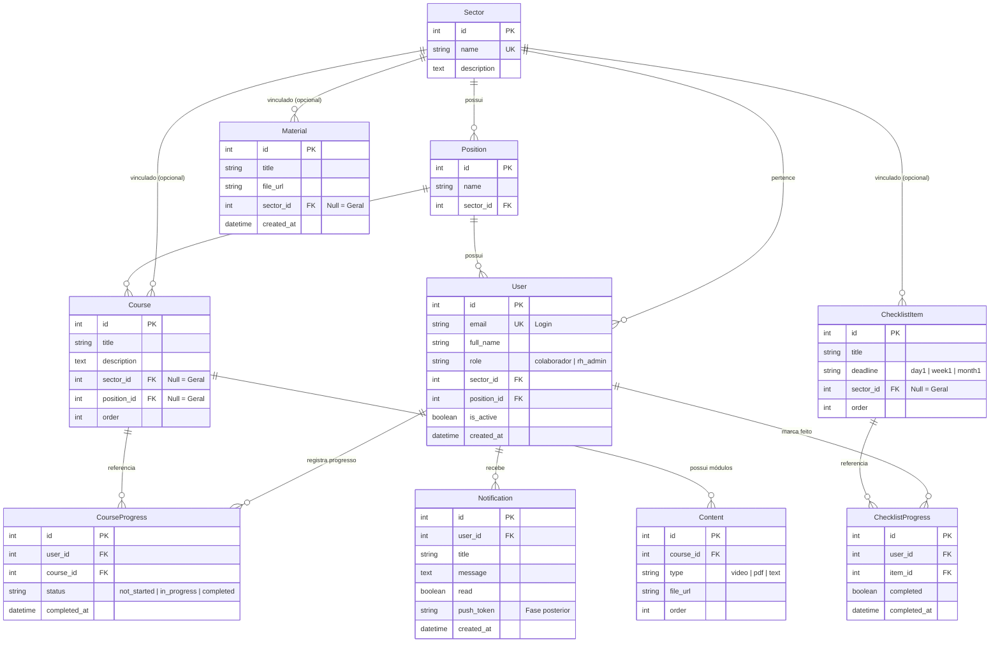

# 📋 CONTEXTO DO PROJETO — Sistema de Integração de Colaborador (Onboarding)

> **Data de Atualização:** 14 de Agosto de 2026  
> **Status:** Redesign Premium SaaS Concluído & Testado (Frontend & Backend 100% Funcionais)  
> **Repositório:** `c:\TCC`

---

## 1. 🎯 Visão Geral do Produto

O **Sistema de Integração de Colaborador** é uma plataforma corporativa SaaS de onboarding desenvolvida para automatizar, estruturar e acompanhar o processo de integração de novos funcionários em uma empresa:

- **Para o Colaborador (App Flutter):**  
  Recebe acesso a uma experiência moderna e intuitiva com trilhas de treinamentos personalizadas por setor e cargo, medidor visual de progresso geral, card "Continue de onde parou", checklist de integração por prazos (Dia 1, Semana 1, Mês 1), biblioteca digital de documentos (políticas, manuais) e central de notificações.

- **Para o RH / Administrador (Painel Django Admin & API REST):**  
  Cadastra e gerencia setores, cargos, cursos, conteúdos em múltiplos formatos (vídeo, PDF, texto), itens de checklist e materiais, além de auditar em tempo real quem concluiu cada treinamento e etapa.

---

## 2. 🛠️ Stack Tecnológica

| Camada | Tecnologia | Detalhes & Bibliotecas |
| :--- | :--- | :--- |
| **Frontend** | **Flutter 3.22+** (Dart 3.4+) | Multiplataforma (Web, Android, iOS, Windows, macOS, Linux) |
| **Design System** | **Google Fonts Inter** + Design Tokens | Cores semânticas, escalas tipográficas, sombras sutis e estados táteis |
| **Gerenciamento de Estado** | **Riverpod 2.5** | `StateNotifierProvider`, `FutureProvider`, `ProviderScope` |
| **Roteamento** | **GoRouter 14** | `ShellRoute` adaptativo + *Auth Guards* automáticos |
| **Rede & Storage** | **Dio 5.4** + **SharedPreferences 2.5** | Interceptor automático de `Bearer <token>`, auto-refresh e persistência |
| **Backend** | **Python 3.14 / Django 5.2** + **DRF 3.18** | Django ORM nativo, migrations automáticas, CORS liberado para dev |
| **Autenticação** | **SimpleJWT 5.5** | Tokens de acesso (60 min) e refresh (7 dias) em payload unificado |
| **Banco de Dados** | **SQLite** (Dev imediato) / **PostgreSQL 16** (Prod) | Configurado via `django-environ` no `.env` |
| **Documentação API** | **drf-spectacular 0.30** | OpenAPI 3.0 / Swagger UI interativo em `/api/docs/` |
| **Testes Automatizados** | **pytest-django 4.14** | 30 testes unitários e de integração (100% aprovados) |
| **Containerização** | **Docker & Docker Compose** | Serviço de banco PostgreSQL + Backend Django |

---

## 3. 📂 Estrutura de Pastas e Arquivos

```text
c:\TCC\
├── docker-compose.yml              # PostgreSQL 16 + Django backend
├── .gitignore                      # Regras completas para Python, Django e Flutter
├── CONTEXTO.md                     # Documento mestre de contexto e arquitetura
│
├── backend/                        # API Django + Django REST Framework
│   ├── manage.py
│   ├── requirements.txt            # Dependências fixadas
│   ├── .env.example / .env         # Variáveis de ambiente (SECRET_KEY, DATABASE_URL, etc.)
│   ├── pytest.ini                  # Configuração do pytest apontando para test_settings
│   ├── conftest.py                 # Fixtures globais de teste (usuários, clientes HTTP)
│   ├── config/                     # Núcleo de configurações do Django
│   │   ├── settings.py             # Settings para execução (CORS dinâmico, JWT, DRF)
│   │   ├── test_settings.py        # Settings para testes (SQLite in-memory)
│   │   ├── urls.py                 # Roteador raiz (/admin/, /api/docs/, /api/v1/)
│   │   └── wsgi.py / asgi.py
│   ├── apps/                       # Módulos da aplicação
│   │   ├── users/                  # Custom User Model, JWT Auth, /me/, permissões, seed_data
│   │   ├── sectors/                # Setores e Cargos
│   │   ├── courses/                # Cursos, Conteúdos e Progresso
│   │   ├── checklist/              # Itens de checklist e conclusão
│   │   ├── materials/              # Repositório de documentos
│   │   └── notifications/          # Notificações do colaborador
│   └── tests/                      # Suíte de testes automatizados (30 testes)
│       ├── test_auth.py
│       ├── test_sectors.py
│       ├── test_courses.py
│       ├── test_checklist.py
│       └── test_materials.py
│
└── frontend/                       # Aplicativo Flutter (arquitetura por feature & Design System)
    ├── pubspec.yaml                # Dependências (Riverpod, GoRouter, Dio, SharedPreferences, Inter)
    ├── analysis_options.yaml
    ├── web/
    │   └── index.html              # Suporte para Flutter Web
    └── lib/
        ├── main.dart               # Entry point com ProviderScope
        ├── app/
        │   ├── app.dart            # MaterialApp.router
        │   ├── router.dart         # GoRouter com ShellRoute e Auth Guards
        │   └── theme.dart          # Design System corporativo completo (Tokens, Inter, Sombras, Cores)
        ├── core/
        │   ├── constants/
        │   │   └── api_constants.dart # URLs base e endpoints da API
        │   ├── network/
        │   │   └── http_client.dart   # Dio com Bearer interceptor e renovação de token
        │   └── widgets/               # Componentes atômicos reutilizáveis
        │       ├── app_card.dart
        │       ├── app_button.dart
        │       ├── app_badge.dart
        │       ├── app_avatar.dart
        │       ├── app_progress.dart
        │       ├── app_skeleton.dart
        │       ├── app_empty_state.dart
        │       ├── app_error_state.dart
        │       ├── app_section_header.dart
        │       ├── custom_button.dart
        │       └── custom_text_field.dart
        ├── features/
        │   ├── shell/              # App Shell adaptativo (Sidebar Desktop / BottomNav Mobile)
        │   │   └── presentation/
        │   │       ├── app_shell.dart
        │   │       └── widgets/ (app_sidebar.dart, app_header.dart)
        │   ├── auth/               # Autenticação Split-Screen
        │   │   ├── data/auth_repository.dart
        │   │   ├── presentation/login_screen.dart
        │   │   └── providers/auth_provider.dart
        │   ├── onboarding/         # Dashboard SaaS principal
        │   │   └── presentation/
        │   │       ├── onboarding_screen.dart
        │   │       └── widgets/ (hero_progress_card.dart, continue_course_card.dart)
        │   ├── courses/            # Cursos & Experiência LMS
        │   │   ├── data/course_repository.dart
        │   │   ├── presentation/
        │   │   │   ├── courses_screen.dart
        │   │   │   ├── course_detail_screen.dart
        │   │   │   └── widgets/ (course_card.dart, course_filter_segmented.dart)
        │   │   └── providers/course_provider.dart
        │   ├── checklist/          # Checklist com linha do tempo (Dia 1, Semana 1, Mês 1)
        │   │   ├── data/checklist_repository.dart
        │   │   ├── presentation/
        │   │   │   ├── checklist_screen.dart
        │   │   │   └── widgets/checklist_item_tile.dart
        │   │   └── providers/checklist_provider.dart
        │   ├── materials/          # Biblioteca digital de documentos corporativos
        │   │   ├── data/material_repository.dart
        │   │   ├── presentation/
        │   │   │   ├── materials_screen.dart
        │   │   │   └── widgets/material_card.dart
        │   │   └── providers/material_provider.dart
        │   ├── notifications/      # Central de Notificações
        │   │   ├── data/notification_repository.dart
        │   │   ├── presentation/notifications_screen.dart
        │   │   └── providers/notification_provider.dart
        │   └── profile/            # Perfil do colaborador
        │       └── presentation/profile_screen.dart
        └── shared/
            ├── models/
            │   ├── user_model.dart
            │   ├── course_model.dart
            │   ├── checklist_model.dart
            │   ├── material_model.dart
            │   └── notification_model.dart
            ├── providers/
            │   └── app_providers.dart
            └── services/
                └── storage_service.dart # Encapsulamento com SharedPreferences
```

---

## 4. 🗄️ Modelo de Dados (ORM Django)



---

## 5. 🌐 Mapa de Endpoints da API REST (`/api/v1/`)

| Módulo | Método | Endpoint | Acesso | Descrição |
| :--- | :---: | :--- | :---: | :--- |
| **Auth** | `POST` | `/api/v1/auth/token/` | Público | Login (retorna `access`, `refresh` e `user`) |
| **Auth** | `POST` | `/api/v1/auth/token/refresh/` | Público | Renovação do access token |
| **Auth** | `GET/PATCH` | `/api/v1/auth/me/` | Autenticado | Perfil do usuário autenticado |
| **Auth** | `POST` | `/api/v1/auth/register/` | RH Admin | Cadastro de novo colaborador |
| **Setores** | `GET/POST` | `/api/v1/sectors/` | Autenticado / RH | Lista / Cadastra setores |
| **Setores** | `GET` | `/api/v1/sectors/<id>/positions/`| Autenticado | Lista cargos vinculados ao setor |
| **Cargos** | `GET/POST` | `/api/v1/sectors/positions/` | Autenticado / RH | Lista / Cadastra cargos (suporta `?sector=`) |
| **Cursos** | `GET` | `/api/v1/courses/` | Autenticado | Lista cursos gerais + do setor do colaborador |
| **Cursos** | `GET` | `/api/v1/courses/<id>/` | Autenticado | Detalhe do curso com lista de conteúdos e progresso |
| **Cursos** | `PATCH` | `/api/v1/courses/<id>/progress/` | Autenticado | Atualiza status (`not_started`, `in_progress`, `completed`) |
| **Conteúdos** | `GET/POST` | `/api/v1/courses/contents/` | Autenticado / RH | Módulos (vídeo, PDF, texto) |
| **Checklist** | `GET` | `/api/v1/checklist/` | Autenticado | Itens de integração gerais + do setor |
| **Checklist** | `POST` | `/api/v1/checklist/<id>/toggle/` | Autenticado | Alterna item entre concluído / pendente |
| **Materiais** | `GET/POST` | `/api/v1/materials/` | Autenticado / RH | Manuais e políticas |
| **Notificações** | `GET` | `/api/v1/notifications/` | Autenticado | Notificações do próprio usuário |
| **Notificações** | `POST` | `/api/v1/notifications/mark-all-read/` | Autenticado | Marca todas as notificações como lidas |
| **Notificações** | `POST` | `/api/v1/notifications/<id>/read/` | Autenticado | Marca notificação individual como lida |
| **Docs** | `GET` | `/api/docs/` | Público | Swagger UI interativo |
| **Admin** | `GET` | `/admin/` | Staff / RH | Painel administrativo nativo do Django |

---

## 6. 📱 Experiência e Telas do Frontend Redesenhado (Flutter SaaS)

### 1. Design System & Componentes Atômicos
- **Tipografia:** Google Fonts **Inter** estruturada em escalas com pesos fortes nos títulos e discrição nos textos secundários.
- **Paleta de Cores:** Tokens semânticos para `primary` (Blue 600), `surface`, `card`, `border`, `success` (Emerald), `warning` (Amber) e `error` (Rose).
- **Biblioteca de Componentes:** [`AppCard`](file:///c:/TCC/frontend/lib/core/widgets/app_card.dart), [`AppButton`](file:///c:/TCC/frontend/lib/core/widgets/app_button.dart), [`AppBadge`](file:///c:/TCC/frontend/lib/core/widgets/app_badge.dart), [`AppAvatar`](file:///c:/TCC/frontend/lib/core/widgets/app_avatar.dart), [`AppProgress`](file:///c:/TCC/frontend/lib/core/widgets/app_progress.dart), [`AppSkeleton`](file:///c:/TCC/frontend/lib/core/widgets/app_skeleton.dart), [`AppEmptyState`](file:///c:/TCC/frontend/lib/core/widgets/app_empty_state.dart), [`AppErrorState`](file:///c:/TCC/frontend/lib/core/widgets/app_error_state.dart) e [`AppSectionHeader`](file:///c:/TCC/frontend/lib/core/widgets/app_section_header.dart).

### 2. App Shell Adaptativo (`AppShell`)
- **Desktop & Web (>900px):**
  - **Sidebar Fixa:** Identidade visual, navegação nos módulos com contadores de não lidas e mini-card do colaborador logado no rodapé com botão de logout.
  - **Top Header:** Saudação dinâmica contextual por horário (*"Bom dia, João 👋"* / *"Boa tarde"*), contador de notificações e avatar.
- **Mobile (<900px):**
  - **Bottom Navigation Bar:** Navegação direta nos 5 pilares (*Início*, *Cursos*, *Checklist*, *Biblioteca*, *Perfil*).

### 3. Tela de Login Split-Screen (`LoginScreen`)
- **Desktop:** Lado esquerdo institucional em degradê escuro com propósito, badges de recursos e frase corporativa; lado direito com formulário limpo, toggle de senha, feedback via SnackBar flutuante e atalho com credenciais de teste.
- **Mobile:** Formulário vertical fluído.

### 4. Dashboard Principal (`OnboardingScreen`)
- **Hero Progress Card:** Card em degradê escuro com medidor visual da % de conclusão calculada dinamicamente via API e botão *"Continuar treinamento →"*.
- **Card "Continue de Onde Parou":** Destaque para o curso em andamento com contagem de módulos.
- **Quick Stats:** 3 cards métricos (Treinamentos, Checklist e Biblioteca).
- **Grade de Cursos:** Cards modernos com escopo (`GERAL` ou `TI`), badges de status e acesso direto.

### 5. Catálogo de Cursos & LMS (`CoursesScreen` e `CourseDetailScreen`)
- **Filtros Segmentados:** Alternância instantânea entre *Todos*, *Em andamento* e *Concluídos*.
- **Detalhes do Treinamento:** Banner do curso, módulos de vídeo (com ícone play vermelho), PDF (laranja) e artigos de leitura (azul), além de barra de ação inferior para avançar status com sincronização imediata na API.

### 6. Checklist de Integração (`ChecklistScreen`)
- Organizado na linha do tempo corporativa (**Dia 1**, **Primeira Semana**, **Primeiro Mês**) com checkboxes táteis animados e persistência otimista no endpoint `/checklist/<id>/toggle/`.

### 7. Biblioteca de Materiais (`MaterialsScreen`)
- Repositório de políticas, manuais e guias com badges por setor e ícones por extensão (PDF, DOC, Web).

### 8. Central de Notificações (`NotificationsScreen`)
- Contador de não lidas e botão para marcar todas como lidas.

### 9. Perfil do Colaborador (`ProfileScreen`)
- Resumo pessoal e profissional (Setor, Cargo, Nível de Acesso) e diálogo de confirmação de logout.

---

## 7. 🧪 Status dos Testes Automatizados & QA

### Backend (Pytest)
```powershell
cd c:\TCC\backend
.\venv\Scripts\pytest -v
```
**Resultado:** **30 testes automatizados** cobrindo autenticação, papéis, permissões, cursos, checklist e materiais (100% de sucesso).

### Frontend (Flutter QA)
- `flutter analyze` aprovado sem erros ou warnings.
- `flutter build web` compilando com sucesso (`✓ Built build\web`).

---

## 8. 🚀 Como Executar o Projeto

### Backend (Django API)
```powershell
# 1. Navegar até o diretório backend
cd c:\TCC\backend

# 2. Ativar o ambiente virtual
.\venv\Scripts\Activate.ps1

# 3. Aplicar as migrações no banco SQLite
python manage.py migrate

# 4. Popular o banco com dados de teste iniciais
python manage.py seed_data

# 5. Iniciar o servidor de desenvolvimento
python manage.py runserver
```
- **Painel RH (Django Admin):** `http://localhost:8000/admin/` (Login: `rh@empresa.com` / `senha123`)
- **Swagger UI:** `http://localhost:8000/api/docs/`

### Frontend (Flutter App)
```powershell
# 1. Navegar até o diretório frontend
cd c:\TCC\frontend

# 2. Baixar as dependências
flutter pub get

# 3. Iniciar o aplicativo no Chrome
flutter run -d chrome
```

---

## 9. 🔑 Credenciais para Demonstração

| Perfil | E-mail | Senha | Acesso |
| :--- | :--- | :--- | :--- |
| **Colaborador** | `joao@empresa.com` | `senha123` | App Flutter (Trilha de TI, Checklist, Biblioteca) |
| **RH Admin** | `rh@empresa.com` | `senha123` | App Flutter + Painel Django Admin (`/admin/`) |
